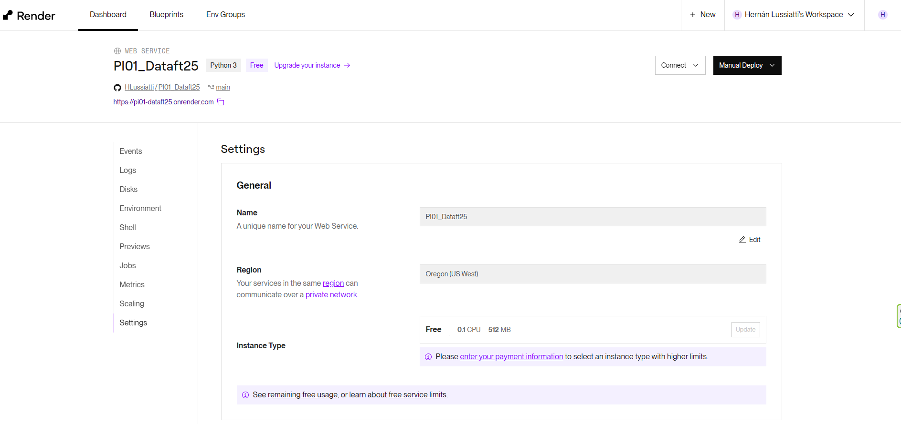
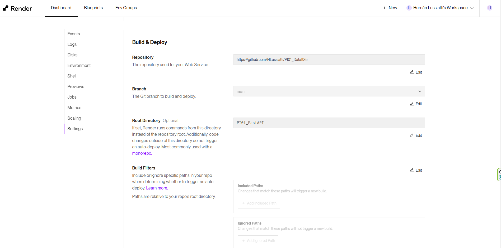
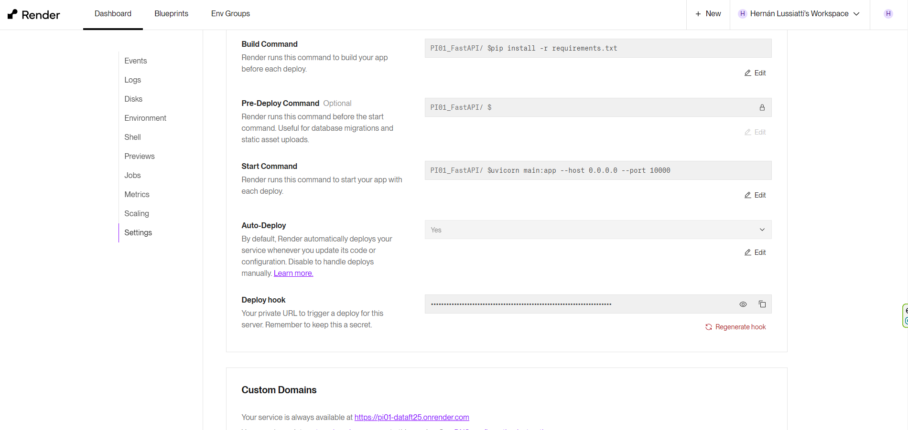
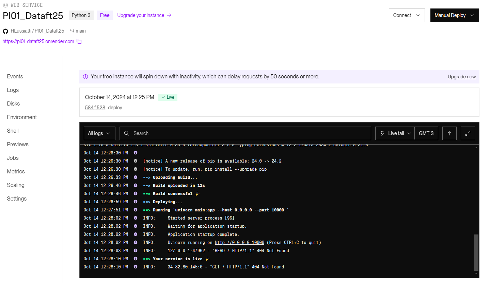
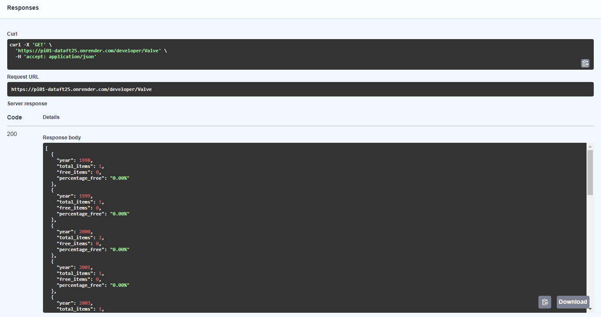
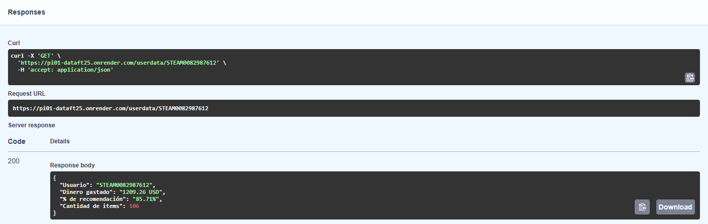
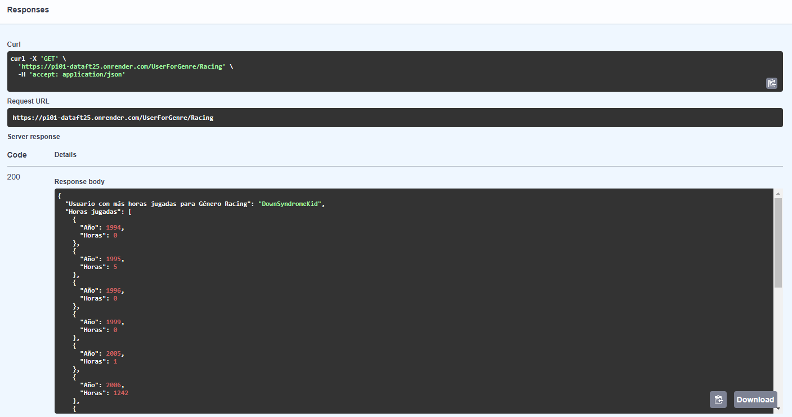
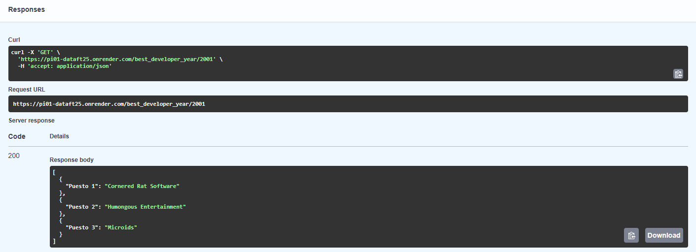
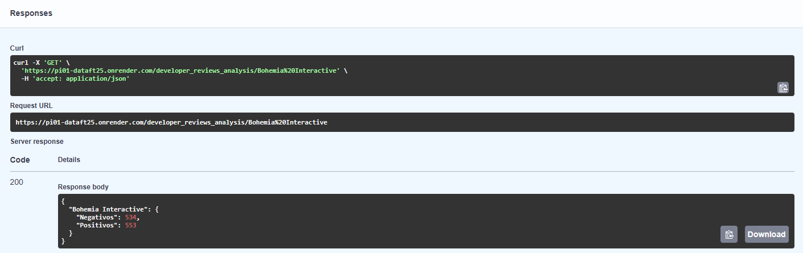
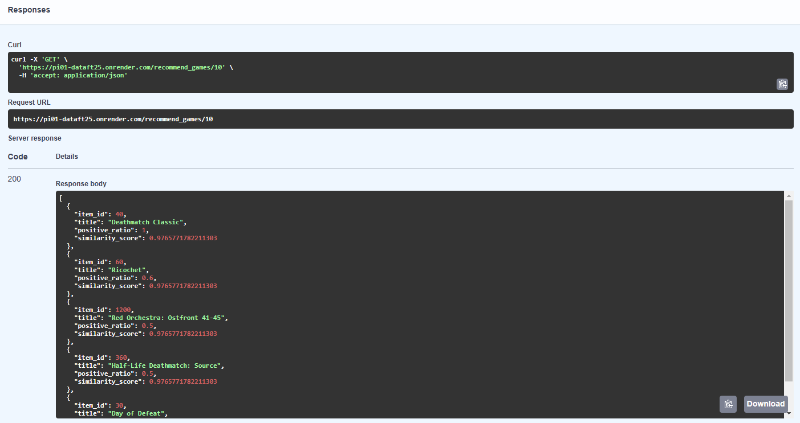

# <h1 align=center> **DATAFT25 - PROYECTO INDIVIDUAL Nº1** </h1>

# <h1 align=center>**Sistema de recomendación de Juegos de Steam**</h1>

# **CONSIGNA:**

- Steam pide que te encargues de crear un sistema de recomendación de videojuegos para usuarios.
- Tener un MVP (Minimum Viable Product) para el cierre del proyecto! 

# TABLA DE CONTENIDO
1. [Ingesta de datos](#1-ingesta-de-datos)
2. [Tratamiento de datos](#2-tratamiento-de-datos)
3. [FEATURE ENGINEERING: Análisis de Sentimiento](#3-feature-engineering-análisis-de-sentimiento)
4. [Creación de las funciones](#4-creación-de-las-funciones)
5. [FastAPI](#5-fastapi)
6. [Deploymet en Render](#6-deploymet-en-render)
7. [EDA](#7-eda)
8. [Modelo ML](#8-modelo-ml)
9. [Resultados](#9-resultados)
   - [9.1. Developer](#91-def-developerdesarrollador--str)
   - [9.2. User Data](#92-def-userdatauser_id--str)
   - [9.3. User for Genre](#93-def-userforgenregenero--str)
   - [9.4. Best Developer Year](#94-def-best_developeryearanio--int)
   - [9.5. Developer Reviews Analysis](#95-def-developer_reviews_analysisdesarrolladora--str)
   - [9.6. Recommended Games](#96-def-recommended_gamesitem_id-int)
10. [Requisitos](#requisitos)
11. [Estructura del Proyecto](#estructura-del-proyecto)

# **TAREAS REALIZADAS:**
# <h3>**1. Ingesta de datos**</h3>

- Las tareas del ETL se separaron en dos notebooks por comodidad de procesamiento.
- La carga de datos se desarrolló en el notebook: **`1. ExtractData.`**
- La ingesta se realizó desanidando los datos necesarios y tratando de optimizar la carga directa manejando los archivos como diccionarios y luego cargandolos en un DataFrame ya que no tenían la estructura json adecuada.
- Los datos se guardaron en archivos del tipo parquet para lograr mayor compresión y poder consumirlos luego con mayor velocidad.
- No se realizaron modificaciones a los datos en esta instancia salvo en el caso del campo **`"price"`** del archivo **`"steam_games"`** el cual requirió ser transformado a texto para poder ser guardado como parquet.

- En esta instancia se obtuvieron los archivos guardados en **`datasets/1. Extracción`**: 
    - **`steam_games.parquet,`** 
    - **`user_reviews.parquet y `**
    - **`users_items.parquet  `**

# <h3>**2. Tratamiento de datos**</h3>

- En el notebook **`"2. TransformData".`** se llevó a cabo el análisis de duplicados, faltantes y outliers.
- En esta instancia se hizo foco en las columnas necesarias para el desarrollo de las funciones y del modelo.
- En principio, no se eliminaron datos nulos en cada columna si había datos en las demás. Luego se eliminan los nulos de las columnas que van a ser utilizadas en la API y el modelo ML.
- Se realizaron las siguientes tareas:
    - Sobre **`steam_games`**:
        - Normalización de la columna **`price`**: se reemplazaron valores string por números.
        - Se reemplazaron valores **`None`** por **`nan`** y eliminaron todas las filas cuyos valores eran nulos en todas las columnas.
        - Se convirtió la columna **`release_date`** al tipo datetime.
        - Se creó una columna **`year`** para ser utilizada en la API.
        - Se renombró el campo **`id`** a **`item_id`** para que coincida con el resto del dataset, se verificaron nulos y se convirtió a entero.
        - Se eliminaron duplicados.
        - Se realizó un análisis superficial de la columna **`developer`** pero su desnormalización es muy grande para esta instancia

        INTENTAR SCRAPEAR LA INFO

    - Sobre **`user_reviews`**:
        - La relación **`user_id - item_id`** no puede ser nula ni estar duplicada.
        - Se convirtió a entero el campo **`item_id`**.
        - Se realizó un análisis de duplicados y se eliminaron.
    
    - Sobre **`user_items`**: 
       - Se verificaron nulos y se convirtió a entero el campo **`item_id`**. 
       - Se realizó un análisis de duplicados. En este caso se identificaron relaciones **`user_id - item_id`** que no tenían exactamente los mimos datos en todas las columnas. Se verificaron algunos casos en Steam aunque la mayoría estaban dados de baja. Finalmente se tomó el criterio de quedarse con aquellos que tengan el campo **`forever_time`** más elevado ya que se supone que debería ser el más reciente.

- En esta instancia se obtuvieron los archivos guardados en **`datasets/2. Depurado`**: 
    - **`steam_games_depurado.parquet,`** 
    - **`user_reviews_depurado.parquet y `**
    - **`users_items_depurado.parquet  `**

# <h3>**3. FEATURE ENGINEERING: Análisis de Sentimiento**</h3>

- Es necesario elaborar el Análisis de Sentiimiento aplicando alguna técnica de Procesamiento de Lenguaje Natural para poder usar el resultado en la API. 
- Se desarrollaron dos modelos en las notebooks **`3. NLP_Texblob"`** y **`3. NLP_Transformers"`**
- Para ello se realizó primero la eliminación de expresiones regulares, la lematización y la tokenización. Lluego se procesaron los resultados utiilizando las librerías Textblob y Transformers.
- Se obtuvieron lso archivos guardados en **`datasets/2. Depurado`**:
    - **`user_reviews_NLP_TextBlob.parquet`**
    - **`user_reviews_NLP_Transformers.parquet`**

# <h3>**4. Creación de las funciones**</h3>

- Se crearon las funciones en el notebook **`"4. Funciones"`**. Estas funciones serán las cargadas en la API.
- Se optimizaron para poder ser procesadas posteriormente en Render.

# <h3>**5. FastAPI**</h3>
    
- Es necesario instalar fastapi y uvicorn
- Se creó una estructura de proyecto en PI01_FastAPI
- Se probó todo de forma local realizando las modificaciones necesarias a los archivos, como por ejemplo:
    - El resultado de las funciones tiene que ser un json para que funcione el framework de FastAPI.

# <h3>**6. Deploymet en Render**</h3>

- En primer luguar se elaboró el archivo de requirements.txt con las librerías mínimas necesarias para el funcionamiento de la API.
    - Si bien este archivo inicialmente se elaboró a partir del la creación de un entorno virtual, es mejor hacerlo manualmente utilizando sólo las librerías mínimas necesarias.   
- Luego se creó una cuenta en Redener y se creó el siguiente entorno: https://pi01-dataft25.onrender.com/docs/
- Se debieron adaptar las funciones creadas en el notbook **`"4. Funciones"`** para funcionar en Render.
    - Por ejemplo, render utiliza **`"/"`** en lugar de **`"\\"`**
    - Como la API parsea las URLs, se deben modificar algunas cosas:
        - Se utiliza año como "anio"
        - Se utilza la librería **`unquote`** para decodificar algunas entradas a las consulas, como por ejemplo, nombres de desarrolladores con espacios.
        - No puede haber nulos a la salida sino no se convierten a json.
    - Se creó una función de eliminación de datos ya que ante muchas consultas consecutivas se caía Render.

# <h3>**7. EDA**</h3>

- Se realizaron los análisis univariado y multivariado más relevantes para el desarrollo del modelo ML y de las funciones.
    - Se eliminaron nulos en **`genres`**, **`specs`** y **`tags`**.
    - Se eliminaron algunos valores de género que no era descriptivos (Free To Play, Early Access)
    - A partir del análisis de **`tags`**, se crea la columna **`tags_new`** que va a tener sólo los tags que no se repiten en **`genres`** ni en **`sepcs`** y que además se encuentran presentes más de 500 veces en todo el dataset.
    - Finalmente se crea la columna **`combined`** que será la combinación de **`genres`**, **`specs`** y **`tags_new`** para ser utilizada en el ML.
- Se agregaron algunas métricas al archivo **`steam_games`** con el objetivo de buscar patrones:
    - Se agregaron métricas de recomendaciones
    - Se agregaron métricas de valorización de reviews del NLP
    - Se agregó un totalizador de tiempo de juego por **`item_id`**.
    - El resultado final se guardó en **`steam_games_postEDA.parquet`**
- No se detectaron relaciones o correlaciones siginificativas entre los datos. ólo se observa una leve correlación lineal  con el total de reviews y el total de horas jugadas de cada juego.
- Por este motivo el modelo de basará fundamentalmente en las caracterísiticas de los juegos: géneros, especificaciones y tags.

# <h3>**8. Modelo ML**</h3>

- Se elaboró el cálculo de la **`cosine_similarity`**  utilizando los valores resultatntes de combinar **`genres`**, **`specs`** y **`tags`** en **`combined`**.
- Como puede haber varios juegos con igual puntaje según el criterio de la matriz del coseno, decido ordenarlos por el **`posiive_ratio`** resultante del NLP.
- Se procedió a realizar el deploy.

# <h3>**9. Resultados**</h3>
- Link del deployed **[API en Render](https://pi01-dataft25.onrender.com/docs)**
- Resultados de todas las consultas:

### **9.1. def developer(desarrollador : str)**

    Devuelve la cantidad de items y el porcentaje de contenido Free por año de lanzamiento del juego para la empresa desarrolladora ingresada.

### **9.2.  def userdata(user_id : str):**
    
    Devuelve la cantidad de dinero gastado por el usuario, el porcentaje de recomendación en base a reviews.recommend y la cantidad de items que posee el usuario.

### **9.3. def UserForGenre(genero : str ):** 

    Deuelve el Usuario que acumula más horas jugadas para el género dado y una lista de la acumulación de horas jugadas por año de lanzamiento.

### **9.4. def best_developer_year(anio : int ):** 

    Devuelve el top 3 de desarrolladores con juegos más recomendados por usuarios para el año dado. (reviews.recommend = True y comentarios positivos).

### **9.5. def developer_reviews_analysis( desarrolladora : str ):** 
    
    Devuelve un diccionario con el nombre del desarrollador como llave y una lista con la cantidad total de registros de reseñas de usuarios que se encuentren categorizados con un análisis de sentimiento como valor positivo o negativo.

### **9.6. def recommended_games( item_id: int ):** 
    
    Devuelve los 5 juegos recomendados ingresando el id de un juego ordenados por puntaje según matriz de similitud del coseno y la proporción de Reviews clasificadas como Positivas.
    

# <h3>**Requisitos**</h3>
- Python 3.7 o superior
- fastapi==0.115.0
- padas==2.2.2
- numpy==1.26.4
- uvicorn==0.31.0
- pyarrow==12.0.0
- json5==0.9.25
- scikit-learn==1.5.2

# <h3>**Estructura del Proyecto**</h3>
- `PI01_FastAPI/`: Contine los códigos funte .py y requiremetns para el deploy en Render.
- `datasts/`: Contiene los archivos de datos.
- `notebooks/`: Jupyter notebooks con el análisis.
- `_src/`: Imágenes utilizadas en el Readme.
- `README.md`: Documentación.
